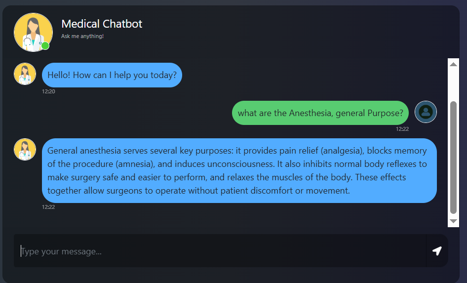

# 🏥 Medical RAG Chatbot — Book-Grounded Medical Q&A

<!-- Header Section -->

<div align="center">



</div>

> A retrieval-augmented chatbot that answers user questions strictly from the content of a medical reference book, using semantic search and an LLM — built to avoid unsupported medical claims by grounding every answer in retrieved source material.

**[GitHub Repo]( https://github.com/KzRaihan/Medical-RAG-Chatbot)** · **[Detailed Docs](Document/ARCHITECTURE.md)**

---


---

## 📌 Problem

Asking a general-purpose LLM a medical question directly introduces a reliability problem: the model can generate answers that are inaccurate, outdated, or entirely unsupported by any real medical source. At the same time, manually searching a medical textbook for a specific answer is slow and requires already knowing the right terminology.

**Real-world question:** *Can a conversational system answer medical questions while staying strictly grounded in one verified source document, rather than the model's own general knowledge?*

---

## 🎯 Objective

Build a chatbot that retrieves the most relevant passages from a medical reference book for a user's question, and generates a concise answer grounded in that retrieved context — with the system explicitly instructed to acknowledge when the source material doesn't contain an answer, rather than guessing.

---

## 🏗️ Architecture

<div align="center">


</div>

```text
Medical Reference Book (PDF)
        │
        ▼
Document Loader (PyPDFLoader via DirectoryLoader)
        │
        ▼
Metadata Filtering (page_content + source only)
        │
        ▼
Text Splitting (RecursiveCharacterTextSplitter, chunk_size=600, overlap=25)
        │
        ▼
Embedding (Hugging Face — all-MiniLM-L6-v2)
        │
        ▼
Pinecone Vector Store (serverless index)
        │
════════╪══════════════════════ query time ══════════════════════
        │
User Question
        │
        ▼
Retriever (top-k=3, similarity search)
        │
        ▼
Retrieved Context
        │
        ▼
LLM (Groq — openai/gpt-oss-20b, temperature=0.1) + Grounded Prompt
        │
        ▼
Answer (displayed in chat UI)
```

Full stage-by-stage breakdown: **[Document/ARCHITECTURE.md](Document/ARCHITECTURE.md)**

---

## 🧩 Tech Stack

| Component | Tool |
|---|---|
| Orchestration | LangChain (LCEL — built without the deprecated chain helpers) |
| Document Loader | PyPDFLoader + DirectoryLoader |
| Text Splitting | RecursiveCharacterTextSplitter (chunk_size=600, overlap=25) |
| Embedding Model | `sentence-transformers/all-MiniLM-L6-v2` (Hugging Face) |
| Vector Database | Pinecone (serverless, cosine similarity) |
| LLM Inference | Groq — `openai/gpt-oss-20b` (temperature=0.1) |
| Backend | Flask |
| Frontend | HTML/Bootstrap chat interface |
| Deployment | Docker |

---

## 🧠 Key Design Decisions

- **Low temperature (0.1)** — even lower than a typical Q&A setting, prioritizing consistency and factual grounding over any creative variation, given the domain
- **Metadata filtering before chunking** — documents are reduced to just `page_content` and `source` before splitting, keeping the pipeline lean and preserving source traceability
- **Manual LCEL retrieval chain** — built directly on `langchain-core` rather than the higher-level `create_retrieval_chain` helper, avoiding an extra dependency on `langchain-classic` and keeping the chain's behavior fully explicit
- **Explicit fallback instruction** — the system prompt instructs the model to say it doesn't know rather than answer beyond the retrieved context

---

## 📊 Example Interaction

**User Question 1:** 
```bash
Tell me about Acne?
```
**Medical Chatbot Response 1:**
```bash
Acne is a skin disorder characterized by the inflammation of sebaceous glands. It commonly manifests as pimples, blackheads, or cysts, often affecting the face. Acne can affect individuals of all ages but is most prevalent during adolescence.
```

**User Question 2:** 
```bash
What is teh Treatment of Acne?
```
**Medical Chatbot Response 2:**
```bash
The treatment of acne depends on its severity __ mild, moderate, or severe. For mild noninflammatory acne, options include topical treatments like tretinoin, benzoy peroxide, adapalene, or salicylic acid. In cases of inflammatory acne, topical antibiotics my be added, and improvement is usually seen in two to four weeks.
```


---

##  Key Insight

Grounding a medical chatbot's answers in one verified source—rather than the model's own training knowledge—means the hard problem isn't "can the LLM answer this," but "can retrieval reliably surface the right passage, and will the model honestly say so when it can't." Keeping the temperature low and the prompt's fallback instruction explicit were both deliberate choices to reduce the model's tendency to fill gaps with plausible-sounding but unsupported answers.

---

## Limitations (current)

- Grounded in a single reference book — cannot answer questions outside that source's coverage
- No source citation shown to the user yet, despite source metadata being tracked internally
- No conversation memory — each question is handled independently, with no multi-turn context
- No automated evaluation yet of retrieval quality or answer correctness
- Intended for general health information only — not validated for clinical or diagnostic use

---

## 🚀 𝙃𝙤𝙬 𝙩𝙤 𝙍𝙪𝙣 𝙩𝙝𝙚 𝘼𝙥𝙥𝙡𝙞𝙘𝙖𝙩𝙞𝙤𝙣

### 1️⃣ Clone the Repository

```
    git clone https://github.com/KzRaihan/Medical-RAG-Chatbot

```

### 2️⃣ Create a Virtual Environment

```
    conda create -n llmapp python=3.11 -y 
```

### 3️⃣ Activate the Environment

```
    conda activate llmapp
```

### 4️⃣ Install Dependencies

```
pip install -r requirements.txt
```


### Create a `.env` file in the root directory and add your Pinecone & openai credentials as follows:

```ini
PINECONE_API_KEY = "xxxxxxxxxxxxxxxxxxxxxxxxxxxxx"
GROQ_API_KEY = "xxxxxxxxxxxxxxxxxxxxxxxxxxxxx"
```


```bash
# run the following command to store embeddings to pinecone
python store_index.py
```

```bash
# Finally run the following command
python app.py
```

Now,
```bash
open up localhost:
```


### Techstack Used:

- Python
- LangChain
- Flask
- GPT
- Pinecone


# AWS-CICD-Deployment-with-Github-Actions

## 1. Login to AWS console.

## 2. Create IAM user for deployment

	#with specific access

	1. EC2 access : It is virtual machine

	2. ECR: Elastic Container registry to save your docker image in aws


	#Description: About the deployment

	1. Build docker image of the source code

	2. Push your docker image to ECR

	3. Launch Your EC2 

	4. Pull Your image from ECR in EC2

	5. Lauch your docker image in EC2

	#Policy:

	1. AmazonEC2ContainerRegistryFullAccess

	2. AmazonEC2FullAccess

	
## 3. Create ECR repo to store/save docker image
    - Save the URI: 315865595366.dkr.ecr.us-east-1.amazonaws.com/medibot

	
## 4. Create EC2 machine (Ubuntu) 

## 5. Open EC2 and Install docker in EC2 Machine:
	
	
	#optinal

	sudo apt-get update -y

	sudo apt-get upgrade
	
	#required

	curl -fsSL https://get.docker.com -o get-docker.sh

	sudo sh get-docker.sh

	sudo usermod -aG docker ubuntu

	newgrp docker
	
# 6. Configure EC2 as self-hosted runner:
    setting>actions>runner>new self hosted runner> choose os> then run command one by one


# 7. Setup github secrets:

   - AWS_ACCESS_KEY_ID
   - AWS_SECRET_ACCESS_KEY
   - AWS_DEFAULT_REGION
   - ECR_REPO
   - PINECONE_API_KEY
   - GROQ_API_KEY


## 👨‍💻 Author

**Md Kamruzzaman** — GitHub: [KzRaihan](https://github.com/KzRaihan) · LinkedIn: [Md Kamruzzaman](https://www.linkedin.com/in/kzraihan/)


